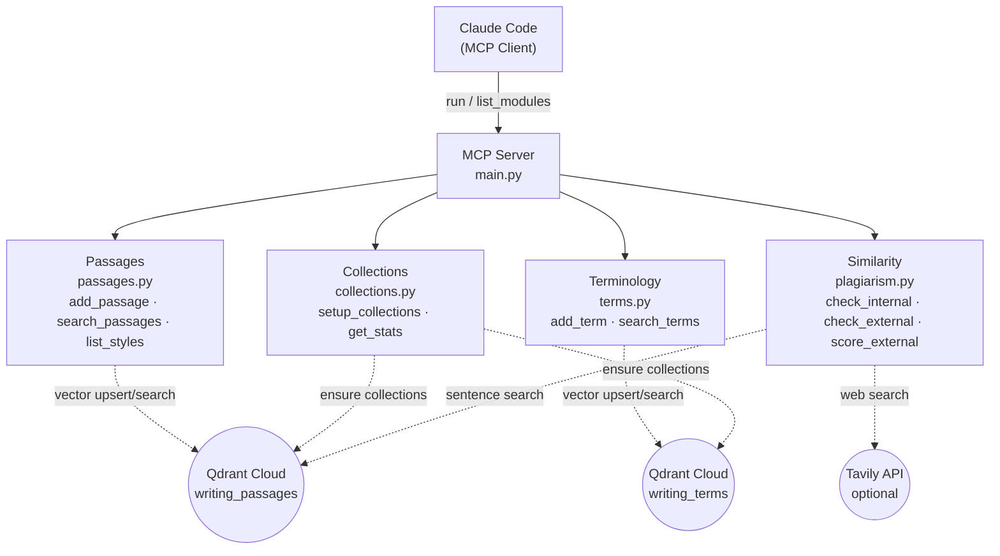

# mcp-writing-library

MCP server for writing passages and terminology dictionary with hybrid semantic search.

## Architecture



## Tools

### Passages

| Tool | Function | Description |
|------|----------|-------------|
| `search_passages` | `search_passages(query, doc_type, language, domain, style, top_k)` | Semantic search over exemplary writing passages |
| `add_passage` | `add_passage(text, doc_type, language, domain, quality_notes, tags, source, style)` | Store an exemplary writing passage |
| `list_styles` | `list_styles()` | List all valid writing style labels with descriptions |

### Terminology

| Tool | Function | Description |
|------|----------|-------------|
| `search_terms` | `search_terms(query, domain, language, top_k)` | Search terminology dictionary for preferred vocabulary |
| `add_term` | `add_term(preferred, avoid, domain, language, why, example_bad, example_good)` | Add a terminology entry |

### Plagiarism & Similarity

| Tool | Function | Description |
|------|----------|-------------|
| `check_internal_similarity` | `check_internal_similarity(text, threshold, top_k_per_sentence, verdict_threshold_pct)` | Detect similarity against the writing library |
| `check_external_similarity` | `check_external_similarity(text, threshold, max_sentences, verdict_threshold_pct)` | Check passage similarity against the web via Tavily |
| `score_external_similarity` | `score_external_similarity(text, search_results, threshold, verdict_threshold_pct)` | Score pre-fetched Tavily results for similarity |

### Utility

| Tool | Function | Description |
|------|----------|-------------|
| `get_library_stats` | `get_library_stats()` | Return point counts for both collections |
| `setup_collections` | `setup_collections()` | Create or verify Qdrant collections |

## Setup

```bash
# Install dependencies
uv pip install -e .

# Copy and fill env vars
cp .env.example .env.local

# Create Qdrant collections (run once)
uv run python scripts/setup_collections.py

# Seed with initial data
uv run python scripts/seed_from_markdown.py

# Start server
uv run python main.py
```

## Valid Metadata Values

| Field | Values |
|-------|--------|
| `doc_type` | `executive-summary` · `concept-note` · `policy-brief` · `report` · `email` · `general` |
| `language` | `en` · `pt` |
| `domain` | `srhr` · `governance` · `climate` · `general` · `m-and-e` |

## Version History

| Version | Date | Summary |
|---------|------|---------|
| 1.1.0 | 2026-03-17 | Styles system, plagiarism/similarity checks, 4 new tools |
| 1.0.0 | 2026-03-15 | Initial release: 6 tools, passages + terms modules, cloud Qdrant |
