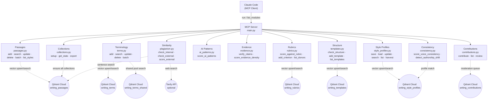

# mcp-writing-library

MCP server for writing passages and terminology dictionary with hybrid semantic search.

## Architecture



## Tools

### Passages

| Tool | Function | Description |
|------|----------|-------------|
| `search_passages` | `search_passages(query, doc_type, language, domain, style, top_k)` | Semantic search over exemplary writing passages |
| `add_passage` | `add_passage(text, doc_type, language, domain, quality_notes, tags, source, style)` | Store an exemplary writing passage |
| `list_styles` | `list_styles()` | List all valid writing style labels with descriptions |

### Terminology

| Tool | Function | Description |
|------|----------|-------------|
| `search_terms` | `search_terms(query, domain, language, top_k)` | Search terminology dictionary for preferred vocabulary |
| `add_term` | `add_term(preferred, avoid, domain, language, why, example_bad, example_good)` | Add a terminology entry |

### Plagiarism & Similarity

| Tool | Function | Description |
|------|----------|-------------|
| `check_internal_similarity` | `check_internal_similarity(text, threshold, top_k_per_sentence, verdict_threshold_pct)` | Detect similarity against the writing library |
| `check_external_similarity` | `check_external_similarity(text, threshold, max_sentences, verdict_threshold_pct)` | Check passage similarity against the web via Tavily |
| `score_external_similarity` | `score_external_similarity(text, search_results, threshold, verdict_threshold_pct)` | Score pre-fetched Tavily results for similarity |

### AI Pattern Scoring

| Tool | Function | Description |
|------|----------|-------------|
| `score_ai_patterns` | `score_ai_patterns(text, language, doc_type, threshold)` | Detect AI writing patterns; calibrated by doc_type |

### Evidence & Claims

| Tool | Function | Description |
|------|----------|-------------|
| `verify_claims` | `verify_claims(text, domain)` | Citation-based claim verification with ghost-stat detection; fully self-contained |
| `score_evidence_density` | `score_evidence_density(text, domain)` | Offline ratio of evidenced vs. bare assertions |

### Donor Rubrics

| Tool | Function | Description |
|------|----------|-------------|
| `score_against_rubric` | `score_against_rubric(text, donor, section, doc_context)` | Score passage against donor evaluation criteria |
| `add_rubric_criterion` | `add_rubric_criterion(donor, section, criterion, weight, red_flags)` | Store a rubric evaluation criterion |
| `list_rubric_donors` | `list_rubric_donors()` | List all donors with stored criteria |

### Document Structure

| Tool | Function | Description |
|------|----------|-------------|
| `check_structure` | `check_structure(text, donor, doc_type)` | Detect present/missing/misplaced sections |
| `add_template` | `add_template(donor, doc_type, sections)` | Store document section template |
| `list_templates` | `list_templates()` | List all stored templates |

### Voice Consistency

| Tool | Function | Description |
|------|----------|-------------|
| `score_voice_consistency` | `score_voice_consistency(sections, profile_name)` | Score voice drift across document sections |
| `detect_authorship_shift` | `detect_authorship_shift(text)` | Unsupervised detection of voice deviation |

### Style Profiles

| Tool | Function | Description |
|------|----------|-------------|
| `save_style_profile` | `save_style_profile(name, description, style_scores, rules, anti_patterns, sample_excerpts, source_documents, channel)` | Save a writing style profile tagged with a publishing channel |
| `load_style_profile` | `load_style_profile(name)` | Load a saved style profile by name |
| `update_style_profile` | `update_style_profile(name, new_style_scores, new_rules, new_anti_patterns, channel, score_weight)` | Blend new evidence into an existing style profile |
| `search_style_profiles` | `search_style_profiles(text, top_k, channel)` | Find best matching style profile, optionally filtered by channel |
| `list_style_profiles` | `list_style_profiles(channel, limit)` | Browse all saved style profiles, optionally filtered by channel |
| `harvest_corrections_to_profile` | `harvest_corrections_to_profile(profile_name, language, domain, min_corrections)` | Surface candidate rules from the human-correction corpus |

### Contributions & Moderation

| Tool | Function | Description |
|------|----------|-------------|
| `contribute_term` | `contribute_term(preferred, contributed_by, avoid, domain, language, why, note)` | Submit a term to the shared moderation queue |
| `contribute_thesaurus_entry` | `contribute_thesaurus_entry(headword, contributed_by, language, domain, ...)` | Submit a thesaurus entry for review |
| `contribute_rubric` | `contribute_rubric(framework, section, criterion, contributed_by, weight, red_flags)` | Submit a rubric criterion for review |
| `contribute_template` | `contribute_template(framework, doc_type, sections, contributed_by)` | Submit a document template for review |
| `list_contributions` | `list_contributions(status, target, contributed_by, limit)` | List contributions (own only for non-admins) |
| `review_contribution` | `review_contribution(contribution_id, action, reviewed_by, rejection_reason)` | Publish or reject a pending contribution (admin only) |

### Utility

| Tool | Function | Description |
|------|----------|-------------|
| `get_library_stats` | `get_library_stats()` | Return point counts for all collections |
| `setup_collections` | `setup_collections()` | Create or verify all Qdrant collections |
| `export_library` | `export_library(collection, format)` | Export a collection to JSON or CSV |

## Setup

```bash
# Install dependencies
uv pip install -e .

# Copy and fill env vars
cp .env.example .env.local

# Create Qdrant collections (run once)
uv run python scripts/setup_collections.py

# Seed with initial data
uv run python scripts/seed_from_markdown.py

# Start server
uv run python main.py
```

## Valid Metadata Values

| Field | Values |
|-------|--------|
| `doc_type` (passages) | `executive-summary` · `concept-note` · `full-proposal` · `eoi` · `policy-brief` · `report` · `annual-report` · `monitoring-report` · `financial-report` · `assessment` · `tor` · `email` · `general` |
| `doc_type` (score_ai_patterns) | `concept-note` · `full-proposal` · `eoi` · `executive-summary` · `annual-report` · `monitoring-report` · `financial-report` · `assessment` · `tor` · `governance-review` · `general` |
| `language` | `en` · `pt` |
| `domain` | `srhr` · `governance` · `climate` · `general` · `m-and-e` · `finance` · `org` · `health` |

## Version History

| Version | Date | Summary |
|---------|------|---------|
| 1.6.0 | 2026-04-05 | Railway-ready: X-Client-ID ContextVar, user_id→client_id rename, client_id in payload |
| 1.5.0 | 2026-04-04 | Remove external KB coupling; admin-guard core writes; restrict export aliases |
| 1.4.1 | 2026-04-03 | Fix missing `psutil` dependency; restores search_terms, search_thesaurus, get_library_stats |
| 1.4.0 | 2026-04-03 | Multi-tenant isolation, contribution moderation, channel-tagged style profiles |
| 1.3.0 | 2026-04-03 | Railway HTTP deployment, bearer token auth, OpenAI embeddings (1536D), thesaurus ×91 |
| 1.2.2 | 2026-03-26 | Social media doc_types: `facebook-post`, `linkedin-post`, `instagram-caption` |
| 1.2.1 | 2026-03-26 | `research_paths` on `verify_claims` — local file evidence tier before Zotero/Cerebellum |
| 1.2.0 | 2026-03-26 | 18 new tools: evidence, rubrics, templates, consistency, style profiles, CRUD, batch, export |
| 1.1.0 | 2026-03-17 | Styles system, plagiarism/similarity checks, 4 new tools |
| 1.0.0 | 2026-03-15 | Initial release: 6 tools, passages + terms modules, cloud Qdrant |
